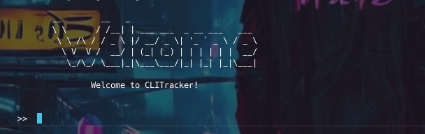
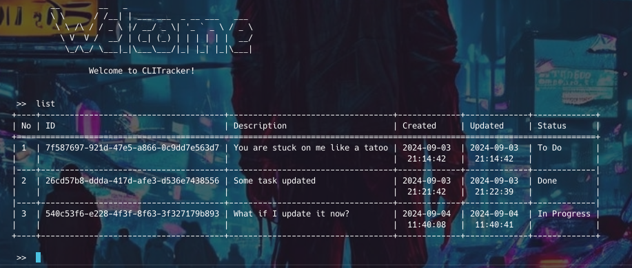

# CLI Task Tracker

The following rust project utilizes rust. I have been learning
Rust and when I came across this project on [Roadmap Sh](https://roadmap.sh) it just
rang back to my new knowledge. So lets put it into test.

## Project

[CLI Task Tracker on Roadmap.sh](https://roadmap.sh/projects/task-tracker)

## Requirements

- [Rust](https://rustup.rs) `1.80.1`

## Release

The release is the easiest way to run this program.

- Download the binary from [CLI Task Tracker](https://github.com/rollingghost/cli-task-tracker/releases/download/Productivity/cli-task-tracker)
- On linux open the terminal
- Navigate to the directory where the binary is located
- Use the command `./cli-task-tracker` or `./cli-task-tracker --help` for help

## Usage

After installing rust

- Ensure rust is working properly by running
  - `rustc --version`
- After cloning navigate to the directory and run
  - `cargo run <options>` or use `cargo run --help` for help
- Or download the binary and run directly on the terminal
- If you are using linux you can move the binary to `/usr/bin`
  for a global effect

## Supported commands

- `add <description>` creates new task and by default it is marked as todo
- `stage <id>` puts the task into progress
- `update <id description>` updates a task
- `done <id>` marks a task as done
- `delete <id>` deletes a task
- `list --status all` lists all tasks default is `all`
- `list --status staged` lists tasks that are marked as in progress
- `list --status done` lists tasks that are marked as done
- `list --status todo` lists task that are marked as todo

## Features

- [x] Add task
- [x] Delete task
- [x] Update task ()
- [x] List tasks by status

## Contributions

Feel free to contribute to this project by forking and creating a pull request
